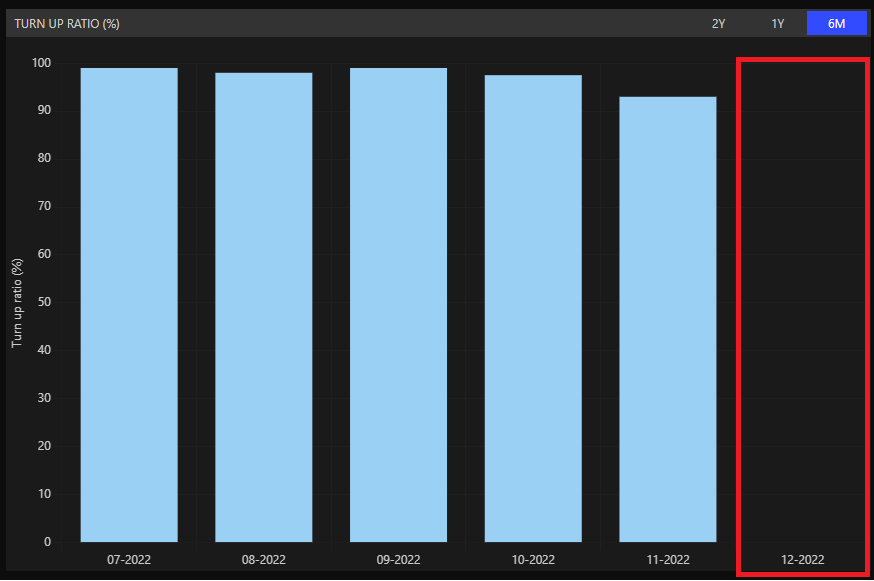

# Backend Runbook

This is for backend developers on Immersion Day. We aim to guide you through the development process, including fixing bugs and adding features within a limited time. You can follow this guide step by step.

## Pre-Requisite

we need to start installation and run dev tools for development

1. run `npm install` in cmd, to install dependencies
2. run the command `npm run start:dev`
3. open http://localhost:3030

## First Bug - Turn UP RATIO(%) 6 month is missing

### Problem

When we click 6M in the TURN UP RATIO (%) graph, we see that the last bar chart is missing. We need to fix this by ensuring it returns the correct data.


### Investigation

We need to check why the data is missing. Is the API on the backend returning data correctly, or is the frontend manipulating the data and returning it incorrectly? We should check the network request tab for more information.

1. Open chrome, and open DevTools - Chrome for Developers(Ctrl+shift+I) and go to network request tab.
2. Navigate to https://lseg-th.github.io/travelogo-dashboard/
3. The network request should be shown. Look for `sixMonthsTurnupRatioData`
4. We will see that the data is returning only an array of 5 items instead of 6. This means the data returned from the backend API is not correct.
   

### Implementation

1. Navigate to `routeApi.ts`
2. Check `routerApi.get('/v1/sixMonthsTurnupRatioData', getSixMonthsTurnupRatioData);`
3. Click in `getSixMonthsTurnupRatioData` and it will navigate to `controllerTurnupRatio.ts`
4. you will see json respose with data in constant, and data have `FIXME:` so you can change to the data there to make it return correctly


## First Feature - Get Seasonal booking chart and Seasonal checkin chart

We need to improve the API response as well. We agree that, on the frontend side, instead of sending the graph data, we should return only the raw data. The frontend will then handle and format it as needed<br>
Also, we need to return [HTTP Status Codes]("https://dev.to/_staticvoid/the-complete-guide-to-status-codes-for-meaningful-rest-apis-1-5c5") by using `statusCode` as well for make it align with REST API standard.

we will create the `/oneYearSeasonalBookingCheckInData` endpoint, then frontend can re-use it

### Example Response

```json
{
  "data":{
    "booking": [10, 20, 30, 40, 50, 60],
    "checkin": [10, 20, 30, 40, 50, 60]
  }
  "statusCode": "200"
}
```

### Implementation

1. navigate to `src\routes\routeApi.ts` and create new route `routerApi.get('/v1/oneYearSeasonalBookingCheckInData', getOneYearSeasonalBookingCheckInData);`
2. navigate to `src\controllers\controllerSeasonal.ts` and create new return code

```js
const getOneYearSeasonalBookingCheckInData = (req: Request, res: Response) => {
  return res.json(mockBookingAndCheckin);
};
```

3. we need to import `mockBookingAndCheckin` from `assets/mockBookingAndCheckIn.json` by using this code at the very top

```js
import mockBookingAndCheckin from "../assets/mockBookingAndCheckIn.json";
```

4. finally, you need to add `getOneYearSeasonalBookingCheckInData` to export value, then go back to `src\routes\routeApi.ts` and import it at very top

```js
import {
  getOneYearSeasonalBookingCheckInData,
  getOneYearSeasonalIncomeData,
  getThreeYearsSeasonalIncomeData,
} from "../controllers/controllerSeasonal";
```

5. you can navigate to `http://localhost:3030/api/v1/oneYearSeasonalBookingCheckInData` and you will see the results, it return the data from json object
   

#### Adding logical for formatting response

Now we will going into the programming path, we need to mock the response to return data like this

```js
{
  "data":{
    "booking": [10, 20, 30, 40, 50, 60],
    "checkin": [10, 20, 30, 40, 50, 60]
  }
  "statusCode": "200"
}
```

1. We can copy the expected result and assign it to some variable, then return it before start modify

   ```javascript
   const response = {
     data: {
       booking: [10, 20, 30, 40, 50, 60],
       checkin: [10, 20, 30, 40, 50, 60],
     },
     statusCode: "200",
   };
   return res.json(response);
   ```

   and you can see it return example data as expected<br>
   

2. we update the logic by getting `bookingOneYear` and `checkInOneYear` by extract it from json file, and map it to return correct data

   ```js
   const bookingOneYear = Object.values(
     mockBookingAndCheckin["bookings"][0]["2022"]
   );
   const checkInOneYear = Object.values(
     mockBookingAndCheckin["checkin"][0]["2022"]
   );
   ```

   then replace response value with the correct one

   ```js
   const response = {
     data: {
       booking: bookingOneYear,
       checkin: checkInOneYear,
     },
     statusCode: "200",
   };
   ```

3. navigate to `http://localhost:3030/api/v1/oneYearSeasonalBookingCheckInData` and you will see the final result
   
